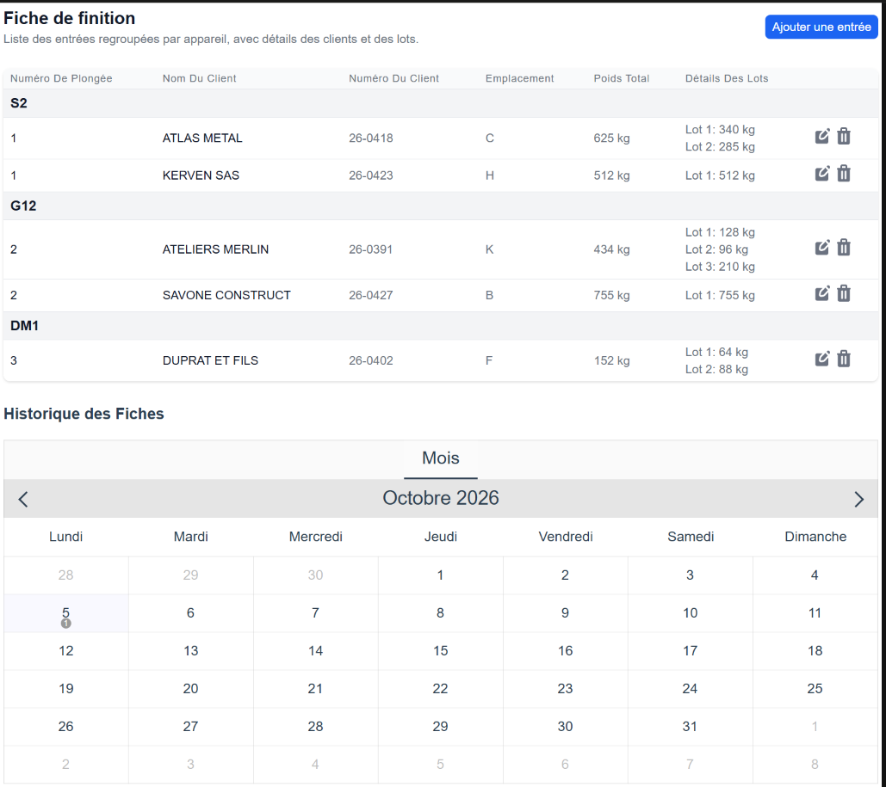
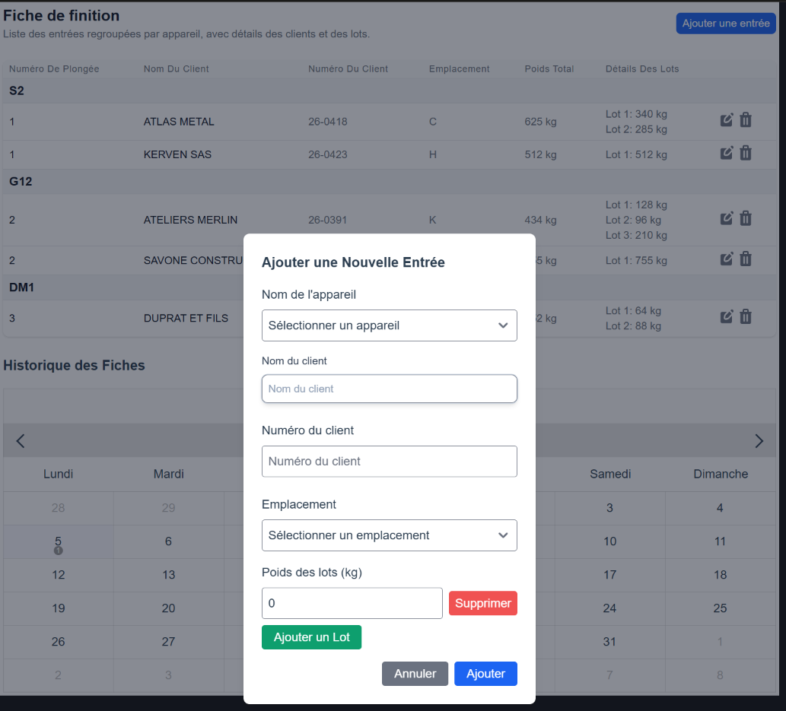

# Finition Galva

Application de saisie des **fiches journalières de finition** pour un atelier de galvanisation à chaud.

Projet personnel, conçu à partir d'un besoin observé sur le terrain : remplacer une fiche papier
recopiée à la main par une saisie rapide, utilisable debout dans l'atelier, et consultable ensuite.



*La fiche du jour : entrées regroupées par appareil, poids totaux calculés, détail des lots,
et l'historique au calendrier. Les données affichées sont fictives.*



*La saisie d'une entrée : appareil, client avec complétion automatique, emplacement de parc
et lots multiples.*

**Compilée en application Android via Capacitor, installée sur un terminal et testée en
conditions réelles à l'atelier, avec l'accord de la hiérarchie.** Les choix décrits plus bas
ne sont donc pas théoriques : ils ont été validés, ou corrigés, par l'usage.

---

## Le problème

À la finition, chaque journée produit une fiche qui récapitule, pour chaque **appareil**
(le support sur lequel les pièces sont accrochées pour le trempage) :

- quel client,
- quel numéro de dossier,
- à quel emplacement du parc les pièces sont rangées,
- et le poids de chaque lot.

Sur papier, cette fiche pose trois problèmes concrets :

1. **La saisie est lente.** On réécrit le nom du client et son emplacement à chaque entrée,
   alors que ce sont presque toujours les mêmes.
2. **Les emplacements se perdent.** Un client revient régulièrement et repart au même endroit
   du parc, mais personne ne s'en souvient de tête.
3. **L'historique est inexploitable.** Retrouver la fiche du 12 du mois dernier suppose de
   fouiller un classeur.

## Ce que fait l'application

- **Fiche du jour** : on démarre une fiche datée, on ajoute les entrées une à une.
- **Regroupement par appareil** : le tableau affiche les entrées groupées, comme sur la fiche papier.
- **Saisie assistée** : le nom du client est complété automatiquement à partir des clients
  déjà enregistrés, et son numéro est repris.
- **Mémoire des emplacements** : quand un client connu revient, son dernier emplacement de parc
  est pré-rempli. C'est la fonction qui fait gagner le plus de temps.
- **Lots multiples** : chaque entrée accepte autant de lots que nécessaire, et la touche Entrée
  ajoute directement le lot suivant. Le poids total est calculé.
- **Correction d'une entrée** : une entrée peut être modifiée ou supprimée après coup, avec
  renumérotation automatique des entrées de l'appareil concerné.
- **Historique au calendrier** : les jours possédant une fiche sont marqués ; un clic recharge la fiche.
  La fiche du jour se charge automatiquement à l'ouverture.
- **Impression** : vue dédiée sur navigateur, et impression native sur mobile via Capacitor.

## Choix techniques, et pourquoi

| Choix | Raison |
|---|---|
| **Pas de serveur, pas de base distante** | L'atelier n'a pas de réseau fiable. L'application doit fonctionner même hors connexion. |
| **IndexedDB** | Stockage local structuré, suffisant pour des fiches journalières, et interrogeable par date. |
| **localStorage pour les derniers emplacements** | Donnée de confort, volumineuse à aucun moment, lue à chaque saisie. |
| **Capacitor** | Permet d'empaqueter la même base de code en application mobile, pour une saisie au poste plutôt qu'au bureau. |
| **Vue 3 et Tailwind** | Composants réactifs et mise en page rapide, sans feuille de style à maintenir. |
| **Saisie au clavier** | La touche Entrée enchaîne les lots. En atelier, on saisit vite ou on ne saisit pas. |

## Modèle de données

```
Fiche (clé : date)
 └── entrées[]
      ├── appareil        (S1, S2, G10 ... référence du support de trempage)
      ├── clientName
      ├── clientNumber
      ├── emplacement     (zone du parc, A à X)
      ├── lots[]          ({ weight: kg })
      └── totalWeight     (calculé)

Client (clé : id auto-incrémenté)
 ├── name
 └── number
```

## Pile technique

Vue 3 · Tailwind CSS · IndexedDB · Capacitor · vue-cal · vue-toastification

## Installation

```bash
npm install
npm run serve     # développement, rechargement à chaud
npm run build     # build de production
npm run lint      # analyse et correction
```

## Confidentialité

**Aucune donnée réelle n'est versionnée dans ce dépôt.** Les fiches et les clients saisis
restent sur l'appareil de l'utilisateur, dans son navigateur. Le dépôt ne contient que le code.

## Ce que l'essai en conditions réelles a appris

- **La saisie au clavier est le vrai sujet.** Enchaîner les lots avec la touche Entrée change
  tout : en atelier, on saisit vite ou on ne saisit pas du tout.
- **Le fonctionnement hors ligne n'est pas une option.** Le réseau n'est pas fiable sur le poste,
  et une application qui attend une connexion n'est jamais utilisée deux fois.
- **Le pré-remplissage de l'emplacement est la fonction la plus rentable**, alors que c'est la
  plus discrète. Elle supprime la recherche mentale la plus fréquente de la journée.

## Limites connues et suites possibles

Le projet est volontairement resté simple. Les points que je traiterais ensuite, dans cet ordre :

- **Sauvegarde et restauration** des données. C'est la limite principale : un stockage local
  se perd avec le navigateur ou l'appareil. Un export de secours doit venir en premier.
- **Export CSV ou PDF** d'une fiche ou d'une période, pour transmettre les poids au service concerné.
- **Découpage du composant principal**, qui concentre aujourd'hui l'essentiel de la logique.
- **Totaux par client et par période**, pour sortir des indicateurs plutôt que des fiches.
- **Tests**, inexistants à ce stade.

---

Développé par Sid Ahmed Benaissa.
